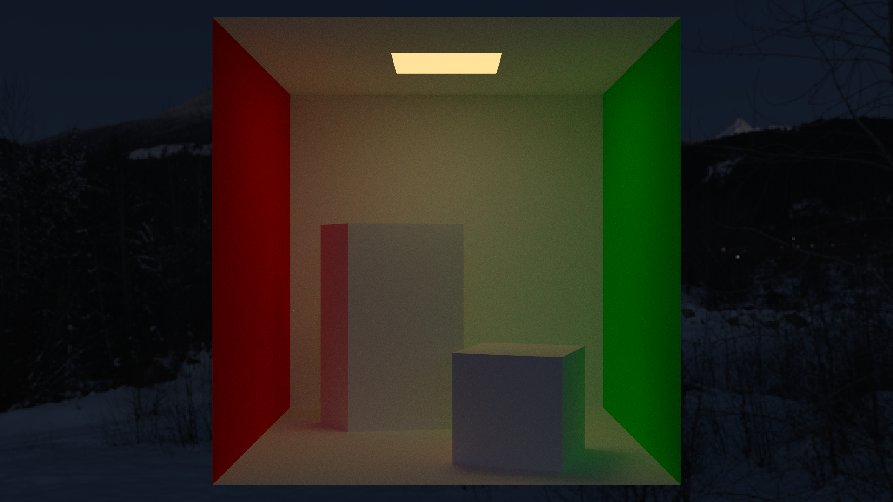
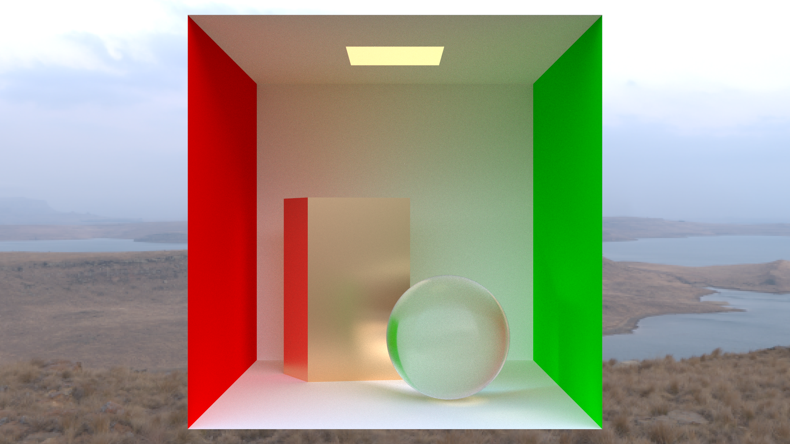
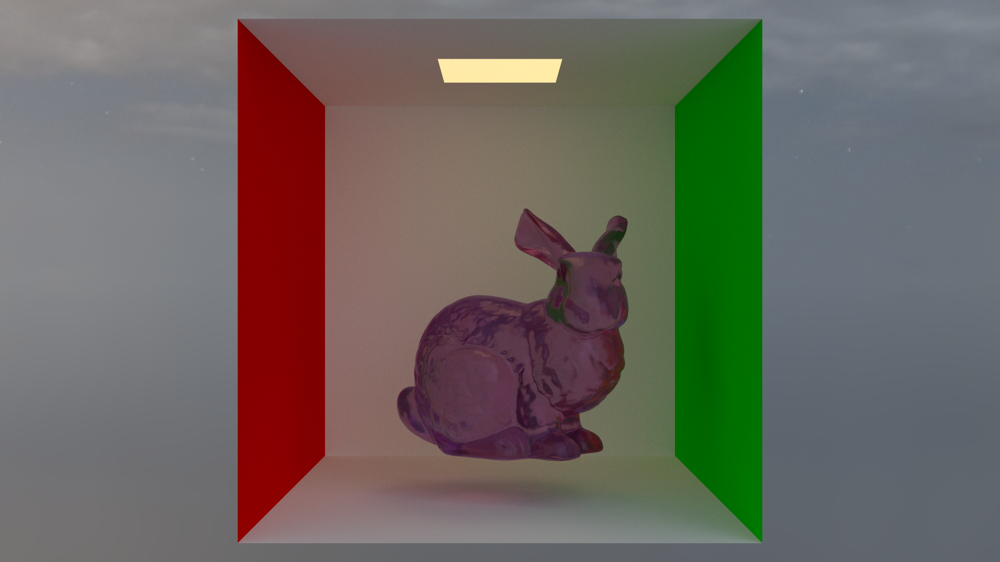
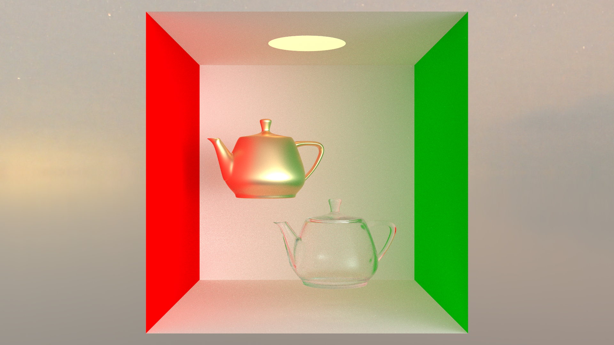

# PBRenderer

- Refer to PBRT-v4
- Build it by msvc

# NameFormat

- file name(xxXxx)
- class name(XxXxx)
- class member var name(mXxx)
- struct name(XxXxx)
- struct member var name(--xxXxx--)
- all funcs name(XxXxx)
- temporary var or func var(xx_xxx)

# Implemented

- BVH
- AreaLight & EnvLight
- Conductor & Dielectric
- Microfacet Theory
- PTRenderer
- MIS
- BDPT (currently aliased to MIS)
- SFML Window
- Easy Threadpool
- Logger

# Todo

- VPT
- SSS
- Medium
- Tone Mapping
- Sobol Sampler
- Spectrum
- Scene Parser
- Imgui Controller
- Transform

# Gallery(1024 spp)

